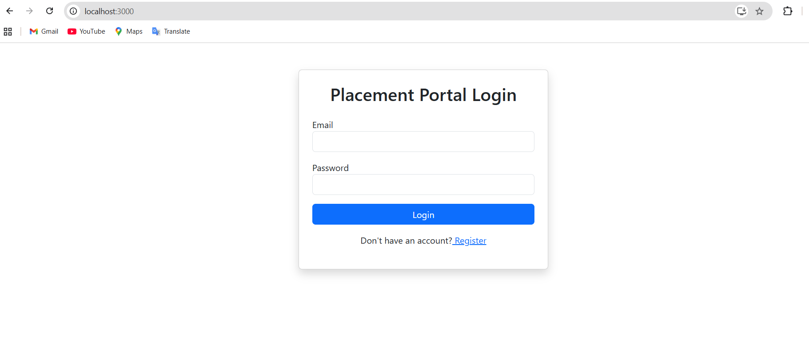
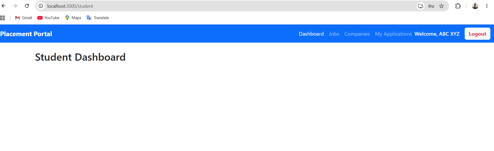
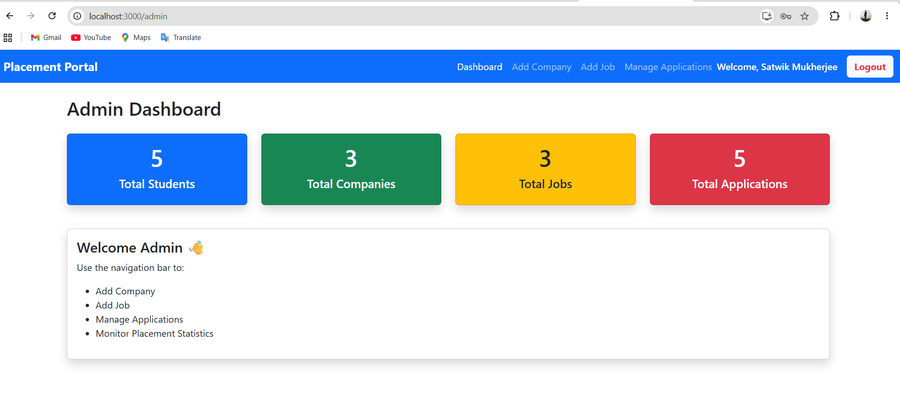
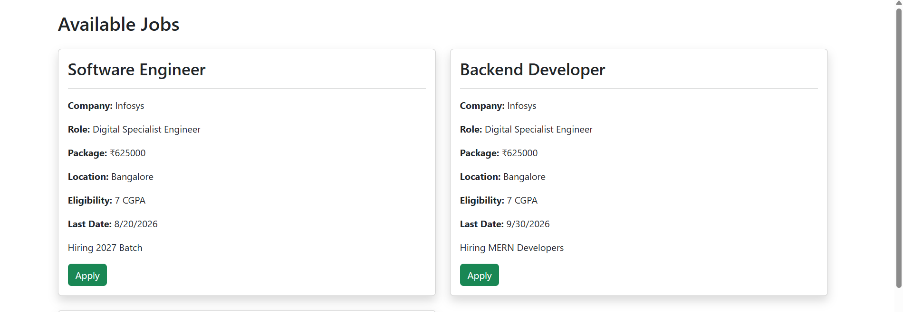
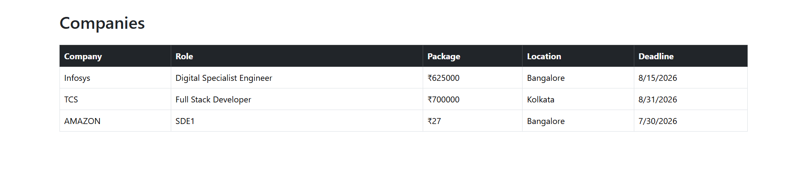
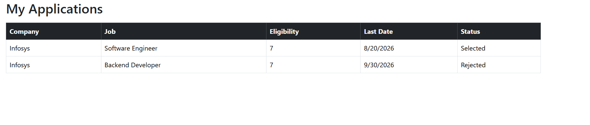

# 🚀 MERN Placement Portal


A full-stack **Placement Portal** built using the **MERN Stack (MongoDB, Express.js, React.js, Node.js)**. The application provides separate dashboards for **Students** and **Admins**, enabling students to explore and apply for jobs while administrators manage companies, job postings, and applications.

---

# 🌐 Live Demo

### 🔗 Frontend
https://mern-job-portal-client.onrender.com

### 🔗 Backend
https://mern-job-portal-zzvo.onrender.com

---

# 📦 GitHub Repository

https://github.com/SatwikMukherjee/mern-job-portal

---

# ✨ Features

## 👨‍🎓 Student Module

- Student Registration
- Secure Login & Logout
- JWT Authentication
- Student Dashboard
- Browse Available Jobs
- View Companies
- Apply for Jobs
- Track Application Status

---

## 👨‍💼 Admin Module

- Secure Admin Login
- Admin Dashboard
- Add Companies
- Manage Companies
- Add Job Openings
- Manage Student Applications
- Approve Applications
- Reject Applications

---

## 🔒 Authentication & Security

- JWT Authentication
- Password Hashing using bcrypt
- Protected Routes
- Role-Based Access Control
- Secure REST APIs

---

# 🛠 Tech Stack

| Layer | Technology |
|--------|------------|
| Frontend | React.js, Bootstrap 5, Axios |
| Backend | Node.js, Express.js |
| Database | MongoDB Atlas, Mongoose |
| Authentication | JWT, bcrypt |
| Routing | React Router DOM |
| Deployment | Render |

---

# ☁️ Deployment

| Service | Platform |
|----------|----------|
| Frontend | Render Static Site |
| Backend | Render Web Service |
| Database | MongoDB Atlas |

---

# 🏗 System Architecture

```text
React.js Frontend
        │
        ▼
Express.js REST API
        │
        ▼
MongoDB Atlas Database
```

---

# 📂 Project Structure

```text
mern-job-portal/
│
├── client/
│   ├── public/
│   ├── src/
│   │   ├── components/
│   │   ├── context/
│   │   ├── layouts/
│   │   ├── pages/
│   │   ├── services/
│   │   ├── App.js
│   │   └── index.js
│   └── package.json
│
├── server/
│   ├── config/
│   ├── controllers/
│   ├── middleware/
│   ├── models/
│   ├── routes/
│   ├── validators/
│   ├── server.js
│   └── package.json
│
├── screenshots/
├── README.md
└── .gitignore
```

---

# ⚙️ Installation

## Clone Repository

```bash
git clone https://github.com/SatwikMukherjee/mern-job-portal.git
```

---

## Install Backend

```bash
cd server
npm install
npm run dev
```

---

## Install Frontend

```bash
cd client
npm install
npm start
```

---

# 🔑 Environment Variables

Create a `.env` file inside the `server` folder.

```env
PORT=5000
MONGO_URI=your_mongodb_connection_string
JWT_SECRET=your_secret_key
```

---

# 📸 Screenshots

## 🔐 Login



---

## 👨‍🎓 Student Dashboard



---

## 👨‍💼 Admin Dashboard



---

## 💼 Jobs



---

## 🏢 Companies



---

## 📄 Applications



---

# 🔄 Application Workflow

```text
Student
   │
   ▼
Register / Login
   │
   ▼
Browse Jobs & Companies
   │
   ▼
Apply for Job
   │
   ▼
Application Stored in MongoDB
   │
   ▼
Admin Dashboard
   │
   ▼
Approve / Reject Application
   │
   ▼
Student Views Updated Status
```

---

# 📖 REST API

## Authentication

| Method | Endpoint | Description |
|---------|----------|-------------|
| POST | /api/auth/register | Register Student |
| POST | /api/auth/login | Login User |

---

## Student

| Method | Endpoint |
|---------|----------|
| GET | /api/student/profile |
| PUT | /api/student/profile |

---

## Jobs

| Method | Endpoint |
|---------|----------|
| GET | /api/jobs |
| POST | /api/jobs |

---

## Companies

| Method | Endpoint |
|---------|----------|
| GET | /api/company |
| POST | /api/company |

---

## Applications

| Method | Endpoint |
|---------|----------|
| POST | /api/application |
| GET | /api/application/my |
| GET | /api/admin/applications |
| PUT | /api/admin/application/:id |

---

# 🚀 Future Enhancements

- Resume Upload
- Company Logo Upload
- Email Notifications
- Forgot Password
- Search & Filter Jobs
- Pagination
- Student Profile Photo
- Interview Scheduling
- Placement Statistics Dashboard
- Live Notifications

---

# 🤝 Contributing

Contributions, issues, and feature requests are welcome.

Feel free to fork this repository and submit a Pull Request.

---

# 👨‍💻 Author

**Satwik Mukherjee**

- 📧 Email: satwikjee2004@gmail.com
- GitHub: https://github.com/SatwikMukherjee
- LinkedIn: https://www.linkedin.com/in/satwik-mukherjee-5aab1b2b9/

---

# ⭐ Support

If you found this project helpful, consider giving it a ⭐ on GitHub.

---

# 📜 License

This project is licensed under the **MIT License**.
